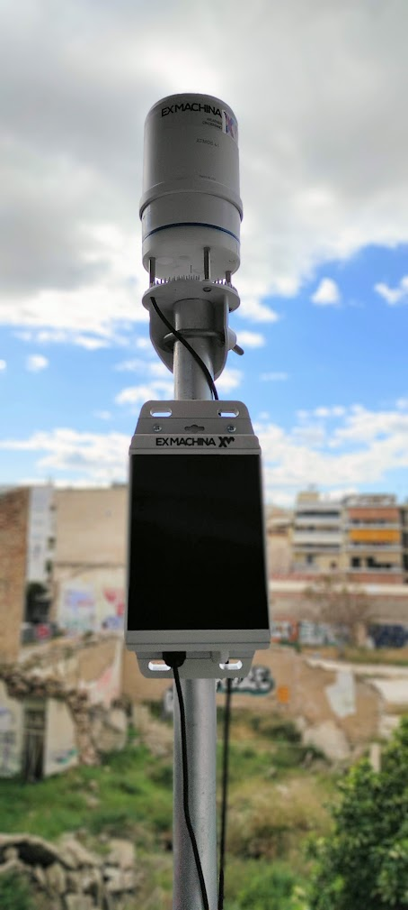
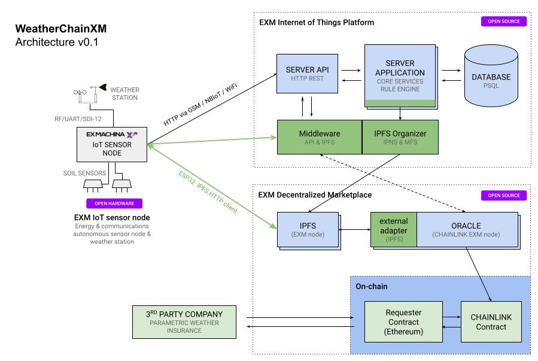

# Short description

CHAINLINK + IPFS open hardware weather station. Energy and communication autonomous IoT sensor node, with weather sensors, that stores sensor data directly to IPFS and automates execution of parametric weather insurance contracts on-chain via the distributed CHAINLINK oracle system. 

# 1. Inspiration - background

At Ex Machina ([exm.gr](https://exm.gr)) we have developed various IIoT environmental monitoring solutions for large enterprises and have worked for many years on the “weather data scarcity problem” trying to solve it with our own hardware solutions. 

We know hyperlocal weather advisory services have a major impact on agriculture, however we see relevant solutions are not yet utilized for small farmers.
 
Crop insurance is another critical tool for the problems faced by small farmers, but again a number of barriers make adoption difficult especially for small farms. Typically, weather risk crop insurance for small farms is expensive due to manual legal work and complexities in claims. DLT Smart contracts could change that - but weather data scarcity and trust regarding the truth of crop conditions, remains a problem, slowing the adoption.

We believe insurance companies should combine their services with precision agriculture solutions to increase their market and bring the most value to farmers. We are working on a compound IoT, DLT solution that can serve them both.

# 2. What it does

This project is a proof of concept attempt to create a weather monitoring IoT solution that directly connects with blockchain smart contracts. 

It enables a parametric weather-risk insurance contract running on-chain to utilize sensor data produced on site and stored off-chain, without sacrificing trust. 

Enables insurance companies to provide small-farmers, parametric weather insurance products without paperwork, with global coverage and with automatic execution of claims.

Enables farmers to benefit from insurance with lower premiums, zero delays in execution of claims, and a cost-efficient IoT precision agriculture/ weather advisory service for their daily operations.

# 3. High-level Architecture

## 3.1 Open hardware weather station

Energy and communication autonomous IoT sensor node that stores sensor data directly to IPFS and automates execution of parametric weather insurance contracts on-chain via the distributed chainlink oracle system.

- 2W solar power and 2x18650 Lithium batteries
- Multi-protocol, global roaming (GPS/GSM/LTE/NBIoT/LoRa/WiFi/BLE).
- Supports plethora of environmental sensors (SDI-12, UART, RF) such as water quality, air quality, noise, soil moisture and various weather stations (Fine Offset / Ambient Weather, Metergroup Atmos41)
- 3D printable, weatherproof enclosure with modular mounting options
- Stores (adds) sensor data (e.g weather conditions) directly to IPFS

### 3.1.1 Microcontroler ESP32 arduino IPFS HTTP client 
Autonomous, low power sensor nodes, are typicaly based on microcontrollers and not full blown (Linux) OS computers. In order to interact directly with IPFS from a microcontroller we had to create an IPFS HTTP client in C for the Espressif ESP32 mcu that our node is based. While we were there, we also made a standalone arduino IPFS HTTP client arduino library and published it in platformio.
https://platformio.org/lib/show/11976/IPFSClientESP32

### 3.2 IPFS & CHAINLINK Middleware

- Reorganizes IPFS stored sensor data (e.g weather conditions) in to MFS & IPNS to provide discoverability using geohashes and timestamps on directory structure.
- Acts as Chainlink external adapter, bridging with smart contracts.

### 3.3 IoT PaaS - Thingsboard
End user visualisation backend, provides dashboards, device managment etc. 
https://thingsboard.io/

# 4. How to Build and Deploy the Project
## 4.1 Hardware Sensor Node
**NOTE**: * firmware/include/boards/ allows for re-wiring pins to a different ESP32 hardware module. Core functionality (i.e. all feature flags set to false) should work on any ESP32 hardware connected over WiFi*

## 4.2.Firmware flash high-level instructions 

The preparation of the EXM IoT sensor node for deployment consists of the following steps:

1. Configure and flash firmware
    -- Set up credentials
    --  Set up app config flags
    --  Build and Flash
2. Create Thingsboard device
3. Boot physical device in config mode to set Thingsboard device access token and cellular network APN

More details here:
[https://github.com/exmgr/exm-iot-node-firmware](https://github.com/exmgr/exm-iot-node-firmware)

## 4.3 IPFS node firmware setup

IPFS flag has to be set to true in order to submit weather data to an IPFS node.

Configure `IPFS_NODE_ADDR` and `IPFS_MIDDLEWARE_URL` in the `credentials.h.template` and rename it to `credentials.h`.

When the node is adding sensor data to IPFS, it is using a [Geohash](https://en.wikipedia.org/wiki/Geohash) as a filename. A geohash is a convenient way of expressing a location (i.e lat/lon) using a short alphanumeric string, with greater precision obtained with longer strings.

Use of geohashes was chosen to assist with data discoverability identifying the nearest available weather station / weather data source.

## 4.4 Node remote device management

Device management takes place over shared attributes controlled by a custom widget. Enables remote device filesystem format, reboot, rtc sync, sensor on/off, and firmware OTA.

## 4.5 EXM IPFS middleware - MFS / IPFN file organizer

IPFS is essentially a distributed file system. As a protocol, it allows many file operations (like copy, remove, etc) that typically exist in traditional file systems. These operations are exposed as commands via a CLI or via a HTTP RPC API. Both of these act on a specific IPFS node.

Although very powerful, this protocol requires multiple commands/HTTP API calls for storing data in a way that is meaningful to the “real world”, e.g. using appropriate file names, organizing files in folders with tree structure, publishing CIDs to IPNS, etc. Having an IoT sensor node perform all these operations on its own would be counterintuitive, as the node’s primary focus is data acquisition and storage, using minimal energy and data.

The EXM IPFS middleware is a backend (Node.js) application that takes care of all the necessary file operations, after a sensor node stores a file on IPFS. It acts as a lightweight HTTP server that listens for requests from the sensor node. As its primary purpose, once it receives an IPFS CID from a sensor node, the middleware performs all the required IPFS file operations. The sensor node only needs to use a single HTTP API call.

### 4.5.1 Functionality

The following endpoints are currently available:

- `GET` `/ipfs/{cid}`: Returns the file contents for the given IPFS [CID](https://docs.ipfs.io/concepts/content-addressing/) hash.

- `POST` `/ipfs/{cid}`: Triggers the necessary IPFS [CID](https://docs.ipfs.io/concepts/content-addressing/) file organizing operations. The method returns immediately with HTTP status 200 and empty body, and the operations take palce in the background.

- `GET` `/weather/{geohash}/latest`: Returns the latest weather telemetry stored in IPFS for the location's [geohash](https://en.wikipedia.org/wiki/Geohash).

- `POST` `/chainlink`: As the above, it returns the latest weather telemetry stored in IPFS for the location's [geohash](https://en.wikipedia.org/wiki/Geohash). However, this endpoint acts as a [Chainlink external adapter](https://docs.chain.link/docs/developers), using the appropriate request/response format. The geohash is passed to the adapter as a POST body, inside the request's `data` object. The weather telemetry is returned again in the `data` object of the response.

### 4.5.2 IPFS private node & pinata

By pinning the root IPNS CID on pinata we ensure all of our data is available on public distributed IPFS servers.

## 4.6 Chainlink node job - adapter setup

Use [Remix Web IDE](https://remix.ethereum.org/) to deploy and test contracts.

1. Deploy Oracle contract in `Oracle.sol`
2. On the deployed contract call setFulfillmentPermission with the parameters [your chainlink node address], true
3. Create bridge in Chainlink node named "weather", pointing to the URL of the adapter (ipfs-middleware repository)
4. Create job and use definition from jobspec.json, setting the address key to the address of the newly deployed oracle.

## 4.7 Solidity contract example
1. Populate EXMWeatherConsumer contract variables:
    - `oracle` The address of the above deployed oracle contract.
    - `jobId` The ID of job created above.
    - `weatherGeohash` The geohash of the weather station used as data source.
2. Fund the deployed contract with *0.1 LINK*.
3. Once the contract is deployed, call `requestWeatherData()` on it.
4. Wait for confirmation. Once it is finished, click `result` and the contract returns the Wind Gust parameter of the weather station (multiplied by 100 in m/s).
